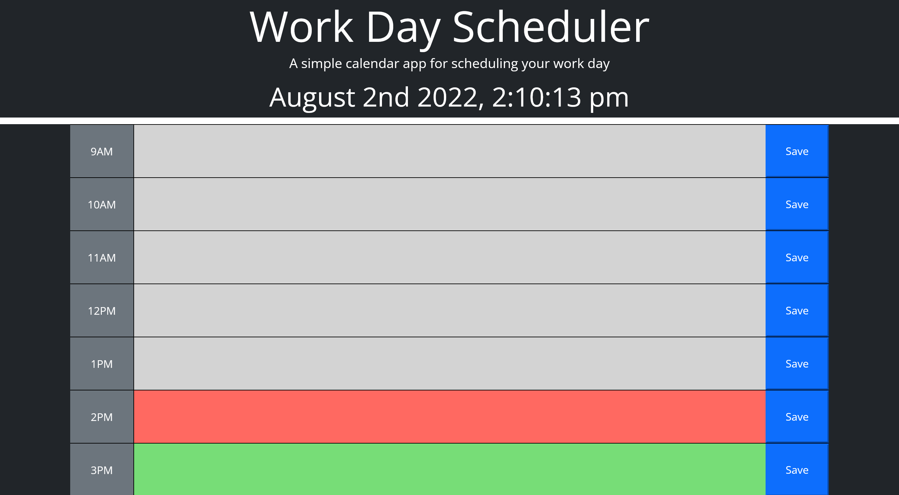
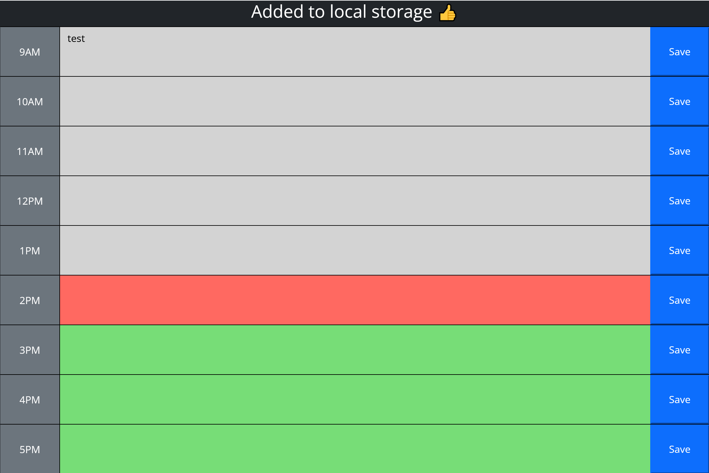

# planner-prism

This week we were given some starter code to develop into a dynamically updated planner

The planner has simple 9am to 5pm timeblocks that green, red, white depending on if they're in the future present or past respectively. There is the current time displayed at the top and you can enter text and press save to save it into the local storage.

# links

[My github profile](https://github.com/AbdalehHersi)

[Planner-prism repository](https://github.com/AbdalehHersi/planner-prism)

[Deployed page](https://abdalehhersi.github.io/planner-prism/)

# screenshots of the deployed page

# challenges

<li>Displaying the past, present and future timeblocks correctly</li>
<li>HTML and CSS layout</li>
<li>Displaying the locally stored data into the timeblocks correctly</li>

# Successes

<li>Displaying current time</li>
<li>Storing user input into the local storage</li>
<li>Targeting the textare to recieve input correctly</li>

# Application requirements

<li>WHEN the user opens the planner
THEN the current day is displayed at the top of the calendar</li>
<li>WHEN the user scrolls down
THEN they are presented with time blocks for standard business hours</li>
<li>WHEN the user views the time blocks for that day
THEN each time block is color-coded to indicate whether it is in the past, present, or future</li>
<li>WHEN the user clicks into a time block
THEN they can enter an event</li>
<li>WHEN the user clicks the save button for that time block
THEN the text for that event is saved in local storage</li>
<li>WHEN the user refreshes the page
THEN the saved events persist</li>